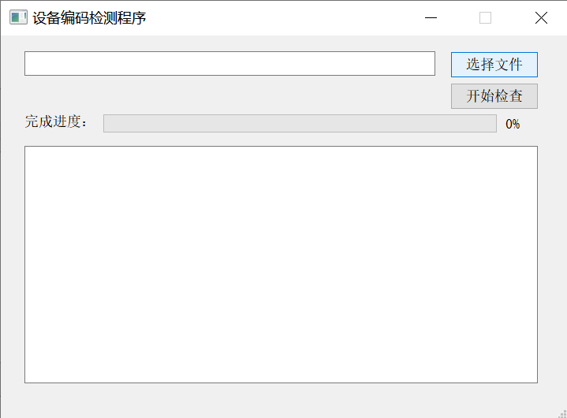
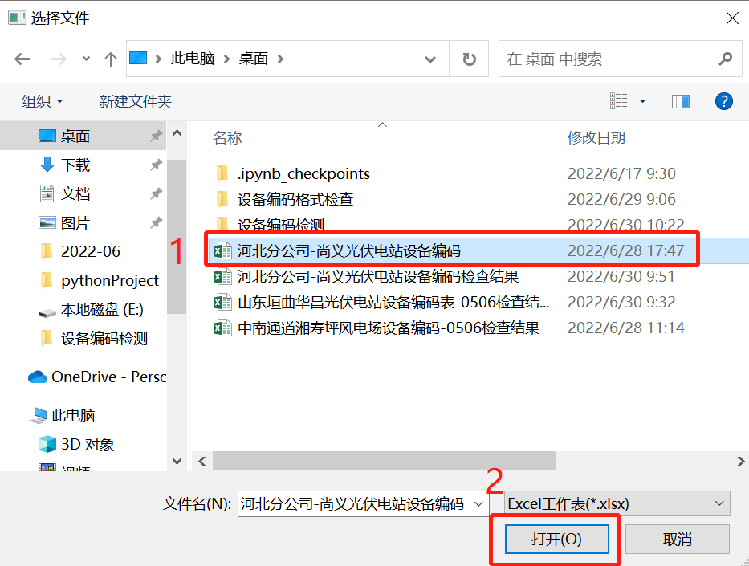
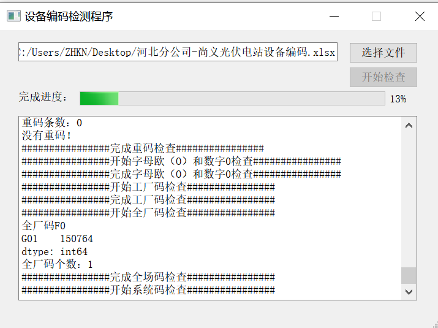
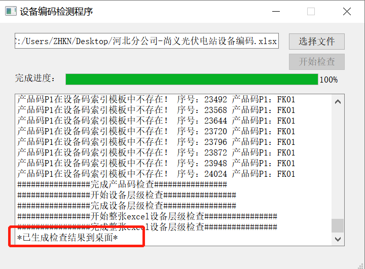

## 文件要求
1. 待检查excel表格必须包含15列字段，按照'序号', '分公司', '场站名称', '场站简称', '场站类型', '设备名称', '工厂码U1', '全厂码F0', '系统码F1','设备码F2', '产品码P1', '产品码P2', '组合', '设备层级', '上级设备编码'的顺序排列。
   - 第A列前不能添加其他列；第O列后可以有其他列，但不会被检查。
   - 具体如下图：

2. 运行时‘设备编码检查程序v1.0.exe’必须与‘设备码索引模板.xlsx’和‘系统码树状图.xlsx’放在同一个文件夹下。

## 操作步骤

1. 双击打开‘设备编码检查程序v1.0.exe’

2. 点击‘选择文件’按钮

3. 选择待检查文件，点击打开

4. 点击‘开始检查’按钮，耐心等待。待进度条显示100%时，检查报告已保存在桌面上。

5. 再次检查请先关闭程序，再重新启动程序。

